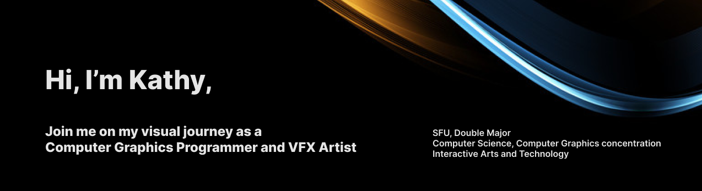
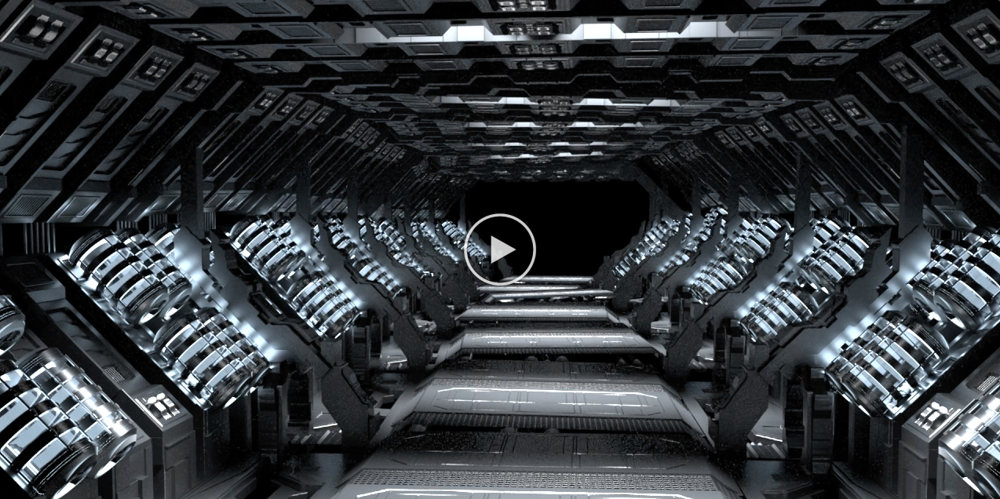

<!--<h1>Hi, I'm Kathy!  Copmuter Science and Interactive Arts and Technology</h1>-->

<h2>Computer Graphics Programming Projects:</h2>

- <b>Python</b>
  - Stable Diffusion GUI 
- <b>JavaScript</b>
  - [3D Volume Modeling, Texturing, and Rendering](https://github.com/kkxthyl/3D-Volume-Modeling.git)
  - [Rasterizing Lines and Triangles](https://github.com/kkxthyl/Rasterizing-Lines-and-Triangles.git)

<h2>Interactive Arts and Technology Projects:</h2>

- <b>Java</b>
  - [Colour Palette Generator - Mobile Application](https://github.com/kkxthyl/Colour-Palette-Generator-Mobile-Application.git)
  - [Autoshop Simulation](https://github.com/kkxthyl/Autoshop-Simulation)
- <b>Processing</b>
  - [Platform Side Scrolling Game](https://github.com/kkxthyl/IAT167-final)
 
<h2>Visual Effects Projects:</h2>

